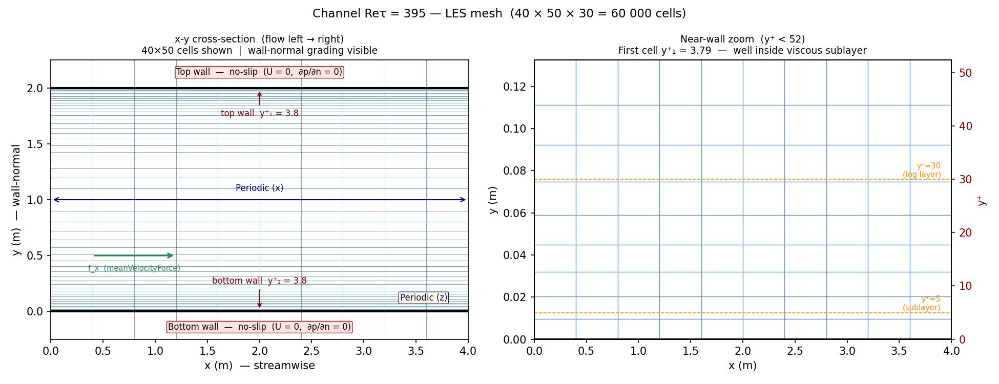
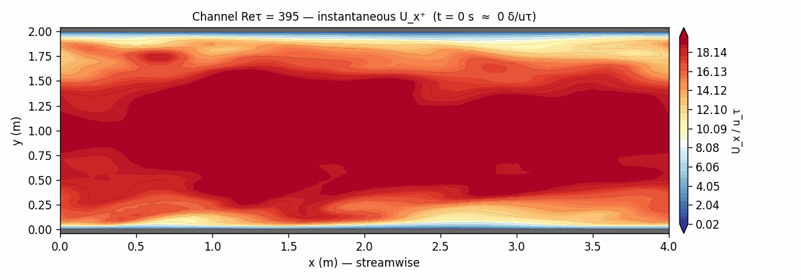
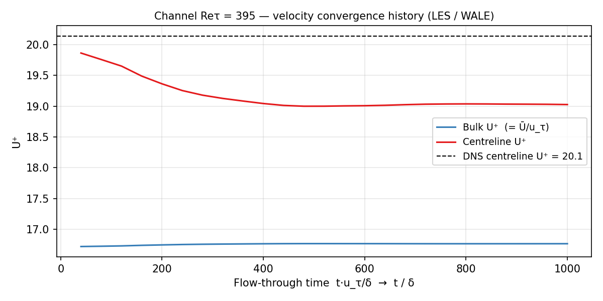
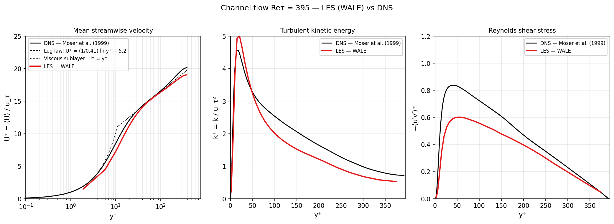

# Turbulent Channel Flow — LES Validation at Reτ = 395

OpenFOAM 13 Large Eddy Simulation of fully developed turbulent channel flow,
validated against the DNS dataset of **Moser, Kim & Mansour (1999)**. The
friction Reynolds number Reτ = u_τ δ / ν = 395, where δ is the channel
half-height and u_τ is the friction velocity.

---

## Physics

A turbulent channel flow is the canonical wall-bounded shear flow. Fluid is
driven between two infinite parallel walls by a streamwise pressure gradient.
The key non-dimensional parameter is the **friction Reynolds number**:

```
Reτ = u_τ δ / ν      u_τ = √(τ_w / ρ)
```

where τ_w is the wall shear stress. The velocity profile divides into three
regions when plotted in wall units (U⁺ = U/u_τ, y⁺ = y u_τ/ν):

| Region | y⁺ range | Profile |
|---|---|---|
| Viscous sublayer | y⁺ < 5 | U⁺ = y⁺ (linear) |
| Buffer layer | 5 < y⁺ < 30 | Transition between sublayer and log law |
| Log layer | y⁺ > 30 | U⁺ = (1/κ) ln y⁺ + B,  κ=0.41, B=5.2 |

The turbulent kinetic energy k = ½⟨u′ᵢu′ᵢ⟩ and the Reynolds shear stress
−⟨u′v′⟩ are primary validation targets alongside the mean velocity profile.

---

## Solver Selection — Why LES with WALE?

### Why not RANS?

RANS turbulence models (k-ω SST, k-ε, etc.) solve averaged equations and
parameterise **all** turbulent fluctuations through an eddy viscosity. In
channel flow, RANS can recover a reasonable mean velocity profile if tuned for
it — but it produces no turbulent fluctuations by definition. It cannot predict
Reynolds stress components individually (only their sum via νt), and it misses
the near-wall anisotropy that makes channel flow an important benchmark.

LES resolves the large, energetically dominant eddies directly and only models
the small (subgrid) scales. This gives access to the full Reynolds stress tensor,
spectrum of velocity fluctuations, and the correct near-wall physics — making it
the appropriate tool when the goal is to reproduce what DNS measures.

### Why WALE?

The **Wall-Adapting Local Eddy-viscosity (WALE)** model is the standard choice
for wall-bounded LES for two reasons:

1. **Correct near-wall scaling**: The WALE eddy viscosity vanishes as
   νsgs ~ y³ near a no-slip wall — matching the asymptotic behaviour of real
   turbulence. Smagorinsky (the simplest alternative) gives νsgs ~ y, which
   is too dissipative near the wall and damps turbulent fluctuations that should
   be resolved.

2. **No wall damping function needed**: Because WALE already has the correct
   y³ scaling built into its formulation, it does not require the van Driest
   damping that Smagorinsky needs. This is important for unstructured or
   non-planar geometries where a wall distance is harder to define cleanly.

### Why not DNS?

DNS resolves all turbulent scales down to the Kolmogorov length η ~ Reτ^(−3/4) δ.
For Reτ = 395 the required mesh is O(N³) ~ (Reτ)^(9/4) ≈ 10⁷ cells — 170× more
than this LES. DNS is used here only as the reference dataset, not as the
computational method.

---

## Domain and Setup

The domain is a rectangular box with no-slip walls at the top and bottom and
**fully periodic** boundary conditions in the streamwise (x) and spanwise (z)
directions. There is no inlet or outlet — the flow is driven by a body force
(`meanVelocityForce`) that adjusts the streamwise pressure gradient at each
timestep to maintain the target bulk velocity Ū = 0.1335 m/s.

| Parameter | Value |
|---|---|
| Channel half-height δ | 1.0 m |
| Domain size | 4δ × 2δ × 2δ |
| ν (kinematic viscosity) | 2 × 10⁻⁵ m²/s |
| Target bulk velocity Ū | 0.1335 m/s |
| Friction Reynolds number Reτ | 395 |
| Friction velocity u_τ = Reτ ν/δ | 0.0079 m/s |
| Mesh | 40 × 50 × 30 = 60 000 cells |
| Wall-normal grading | Expansion ratio 10.7 from each wall |
| First cell y⁺ | ≈ 3.8 (cell centre y⁺ ≈ 1.9) |
| Subgrid model | WALE |
| Run time | t = 1000 s (≈ 2600 δ/u_τ) |

### Flow driving mechanism

There is no pressure inlet/outlet BC. Instead, `meanVelocityForce` in
`fvConstraints` acts as a distributed body force:

```
f_x = (Ū_target − Ū_actual) / Δt
```

At each timestep it measures the volume-averaged streamwise velocity and adjusts
the applied body force to correct any deviation from Ū = 0.1335 m/s. This
implicitly sets Reτ — the wall shear stress (and hence u_τ) that develops is
whatever the turbulence dynamics require at this bulk velocity and viscosity.

### Initial condition

The simulation starts from pre-computed turbulent velocity and subgrid nut fields
(supplied as the tutorial initial condition), avoiding the long laminar-to-turbulent
transition that would otherwise be needed. Statistics are accumulated from t = 0
and are well converged by t ≈ 500.



---

## Flow Animation

Instantaneous streamwise velocity U_x⁺ on the z-midplane — 26 snapshots from t = 0 to 5000 s (≈ 39 δ/u_τ per frame). Near-wall low-speed streaks and the high-velocity core are visible throughout the run.



---

## Results

### Convergence

The mean centreline velocity U⁺ converges from its initial value (~19.8) to a
stationary value of ~19.0 by t ≈ 400–500 and holds steady for the remainder of
the run. The DNS centreline value is U⁺ = 20.1 — a 5% under-prediction consistent
with the coarse LES mesh (see Discussion below).



---

### Validation — mean velocity and turbulence statistics



**Mean velocity U⁺ vs y⁺** (left panel):
The LES correctly captures the viscous sublayer (U⁺ = y⁺ for y⁺ < 5) and tracks
the log law through the log region. The slight under-prediction at the centreline
(U⁺ ≈ 19.0 vs DNS 20.1) is caused by the coarse mesh — the WALE model is slightly
over-dissipative at this resolution, shifting the velocity profile down by ~5%.

**Turbulent kinetic energy k⁺ vs y⁺** (centre panel):
The near-wall TKE peak at y⁺ ≈ 15 (≈ 3.5 u_τ²) is captured by the LES,
though it under-predicts the DNS peak of ≈ 4.5 u_τ². This is expected: the
near-wall peak is driven by streaks and quasi-streamwise vortices at scales of
O(100 wall units) — the mesh resolves these only marginally, so the modelled
(subgrid) contribution takes over some of what DNS resolves explicitly.

**Reynolds shear stress −⟨u′v′⟩⁺ vs y⁺** (right panel):
The LES captures the linear increase from zero at the wall to the plateau in
the log region. The peak value (~0.8 u_τ²) is slightly below the DNS (~1.0 u_τ²),
again consistent with the over-dissipative subgrid model on a coarse mesh.

All three profiles show the correct qualitative behaviour and the quantitative
error is within what is expected for a 60 000-cell LES at this Reynolds number.
A finer mesh (e.g. 128×128×128) would close the gap with DNS at the cost of ~35×
more compute time.

---

## Running the Case

```bash
source /opt/openfoam13/etc/bashrc

blockMesh
decomposePar -cellProc
mpirun -np 16 foamRun -parallel
reconstructPar

python3 postprocess.py
```

---

## References

Moser, R.D., Kim, J. and Mansour, N.N. (1999). *Direct numerical simulation of
turbulent channel flow up to Re_τ = 590*. Physics of Fluids, **11**(4), 943–945.

Nicoud, F. and Ducros, F. (1999). *Subgrid-scale stress modelling based on the
square of the velocity gradient tensor*. Flow, Turbulence and Combustion,
**62**(3), 183–200. (WALE model)

Kim, J., Moin, P. and Moser, R. (1987). *Turbulence statistics in fully developed
channel flow at low Reynolds number*. Journal of Fluid Mechanics, **177**, 133–166.
